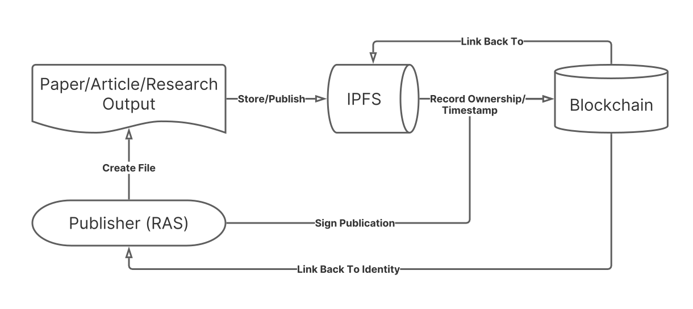

# IntPub — The Interplanetary Publishing Protocol

The Interplanetary Publishing Protocol (IntPub) is a tool researchers, academics, and scientists can use to self-publish their works on uncensorable & decentralized networks.

### Current Model

### IntPub Model

### Single Publisher Flow

### Multiple Publisher Flow

